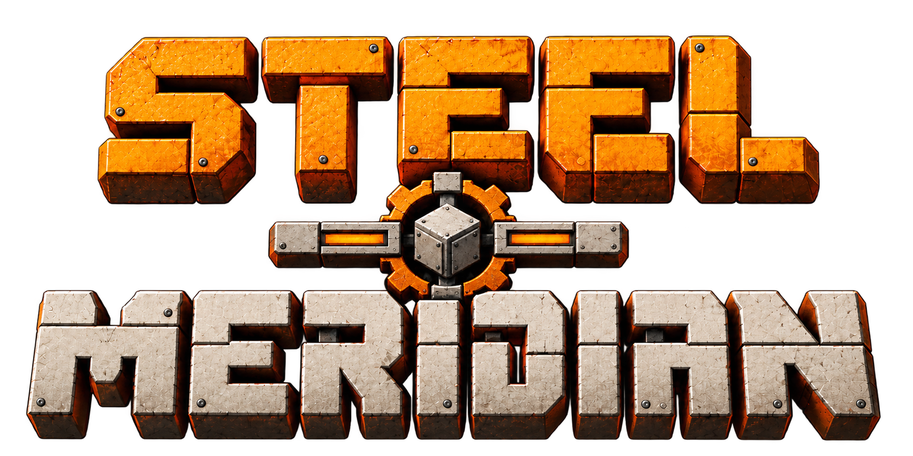

<p align="center">
  
</p>

<p align="center">
  <strong>Factorio-scale industry, rebuilt for Minecraft's three-dimensional world.</strong>
</p>

<p align="center">
  <a href="https://github.com/ZettaBite4031/SteelMeridian/actions/workflows/build.yml">
    
  </a>
  
  
  
</p>

# Steel Meridian

Steel Meridian is a large-scale NeoForge overhaul mod inspired by Factorio's automation, logistics, research, railways, factory construction, and industrial simulation.

The goal is not simply to add conveyor belts and assembling machines to Minecraft. Steel Meridian aims to adapt the systems and progression that make Factorio work while embracing Minecraft's first-person perspective, vertical world, multiplayer, and wider modding ecosystem.

> **Development status:** Early indev / pre-alpha.
>
> Steel Meridian is not currently intended for normal survival play. Expect incomplete systems, breaking changes, and worlds that may not survive future builds.

## Vision

Steel Meridian treats Factorio as the default reference for industrial behavior and Minecraft as the physical world that behavior must inhabit.

That means familiar ideas such as belts, inserters, assembling machines, science, electrical networks, rail logistics, pollution, biters, construction robots, and blueprints should behave recognizably while still making sense in a fully three-dimensional block world.

Where Minecraft creates a genuinely useful opportunity, Steel Meridian can extend the formula rather than flatten it. Vertical factories, dedicated belt lifts, terrain-following rail grades, and interoperability with other technology mods are examples of that philosophy.

## Planned Scope

Steel Meridian is intended to grow toward:

- automated resource extraction and processing
- belts, inserters, splitters, and large-scale item logistics
- assembling machines, furnaces, chemical processing, and production chains
- Factorio-style electrical networks and power generation
- fluid transport and processing
- science packs, laboratories, and a full research tree
- railways, signals, stations, and automated train routing
- construction and logistics robots
- blueprints, construction ghosts, and large-scale building tools
- circuit networks and combinators
- pollution, biter expansion, attacks, and evolution
- modular equipment and late-game industrial progression
- compatibility with the wider modded Minecraft ecosystem

Everything above is a direction, not a claim that the feature already exists.

## First Milestone

The first playable milestone is a complete miniature production loop:

```text
Resource patch
    ↓
Miner
    ↓
Belt
    ↓
Inserter
    ↓
Furnace
    ↓
Assembler
    ↓
Science pack
    ↓
Lab
    ↓
Research
```

## Engineering Direction

Steel Meridian is designed for factories that become large.

High-cardinality systems are not intended to map directly onto thousands of independently ticking Minecraft block entities. Transport, electricity, fluids, logistics, railways, and machine scheduling use higher-level simulation structures so the cost of a factory can scale with meaningful work rather than merely with the number of blocks placed.

The project is server-authoritative and multiplayer-safe by design. Expensive independent workloads may eventually be parallelized, but correctness and deterministic behavior come first.

See [docs/ARCHITECTURE.md](docs/ARCHITECTURE.md) for the current technical direction.

## Compatibility

Steel Meridian keeps its native simulation semantics instead of reducing every system to another mod's API.

Compatibility is provided at explicit boundaries:

```text
Steel Meridian power      ↔ adapters ↔ Forge Energy
Steel Meridian fluids     ↔ adapters ↔ NeoForge fluid handlers
Steel Meridian inventory  ↔ adapters ↔ item handlers
Steel Meridian recipes    ↔ adapters ↔ recipe viewers / automation mods
```

## Building

Steel Meridian currently targets:

- Minecraft 1.21.11
- NeoForge 21.11
- Java 21

### Linux quick start

```bash
git clone https://github.com/ZettaBite4031/SteelMeridian.git
cd SteelMeridian

./scripts/bootstrap.sh
./scripts/check.sh
```

Launch a development client:

```bash
./scripts/client.sh
```

Launch a development server:

```bash
./scripts/server.sh
```

### Other platforms

Install a Java 21 JDK and use the included Gradle wrapper:

```bash
./gradlew build
```

On Windows:

```powershell
.\gradlew.bat build
```

The Gradle wrapper is authoritative. A system-wide Gradle installation is not required.

## Contributing

Steel Meridian is still establishing its foundations. Bug reports, technical discussion, and focused pull requests are welcome, but large feature implementations should be discussed before significant work begins.

Please read [CONTRIBUTING.md](CONTRIBUTING.md) and [docs/ARCHITECTURE.md](docs/ARCHITECTURE.md) before working on core systems.

## License

Steel Meridian is currently **All Rights Reserved**. See [LICENSE](LICENSE).

This may be revisited as the project matures.

## Disclaimer

Steel Meridian is an unofficial fan project inspired by Factorio.

Factorio is a trademark of Wube Software Ltd. Steel Meridian is not affiliated with or endorsed by Wube Software.
